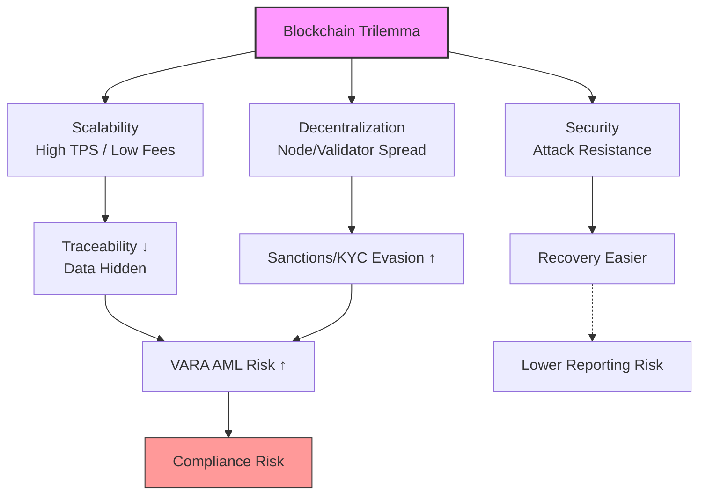

# 01. Blockchain Trilemma – Scalability vs. Compliance Traceability

[](https://www.vara.ae/)
[](https://github.com/yourusername/crypto-compliance-portfolio)


**Framework Objective**  
Show how the classic blockchain trilemma (decentralization, security, scalability) creates hidden compliance risks for VASPs in Dubai under VARA rules — especially after the 2025 Rulebook updates and 2026 enforcement focus on AML, Travel Rule, and high-risk jurisdictions.

This is one piece of my crypto compliance portfolio: deep crypto-native analysis + regulatory mapping

## Core Mechanic: The Trilemma as a Zero-Sum Compliance Game

Blockchains must balance three things — but improving one usually hurts at least one of the others:

- **Decentralization** — Many independent nodes/validators run the network → hard to censor or shut down, but slower decisions.
- **Security** — Very hard to hack or fake transactions → needs strong math and economic penalties, but adds extra work/slowdown.
- **Scalability** — Handles thousands of transactions per second with low fees → but usually bundle a lot of details (e.g., in Layer 2 rollups) → makes individual transactions difficult for compliance.

**In compliance language**: When a blockchain gets super fast and cheap (scalability), it often hides transaction details → this makes AML tracing, Travel Rule (knowing sender/receiver), and sanctions checks much harder.

```python
def trilemma_pressure(protocol_state, vara_threshold=10000):  # TPS example
    scalability = protocol_state.tps * protocol_state.batch_efficiency
    if scalability > vara_threshold:
        onchain_visibility = max(0, onchain_visibility - protocol_state.compression_factor * 0.3)
        decentralization_stability -= protocol_state.sequencer_centralization_risk
    security = protocol_state.consensus_strength - protocol_state.attack_surface
    compliance_risk = (scalability * (1 - onchain_visibility)) / decentralization_stability
    return compliance_risk  # >1.0 → high VARA audit concern
```

## Compliance Vectors in 2026 VARA Context

VARA never uses the word 'trilemma', but if you look at their enforcement actions, they're basically punishing the exact weaknesses that come from these trade-offs.

- **Scalability → traceability suffers**  
  Fast chains and Layer 2s (rollups, sidechains) bundle or compress many transactions to keep speed high and fees low. This hides individual sender/receiver details.  
  → Makes it hard to follow FATF Travel Rule and VARA transaction monitoring rules.

- **High decentralization → evasion becomes easier**
No central control means it's tough to force KYC everywhere or block sanctioned wallets which clashes directly with VARA's 2026 extra checks on high-risk countries  
  → VARA's January 2026 enhanced due diligence rules for high-risk jurisdictions become much harder to satisfy fully.

- **Security trade-offs → laundering & reporting problems**  
  Weaker security (concentrated validators, past network stops, MEV) can allow exploits or reorgs that move dirty money before anyone notices.  
  → Triggers VARA's incident reporting obligation and possible fines for poor operational resilience.

- **2026 supervision reality**  
  After the 2025 Rulebook v2.0 and June 2025 compliance deadline, VARA now focuses on real outcomes: unified risk pictures (on-chain + off-chain), strong AML programs, market integrity, data retention.  
  Trilemma trade-offs make these harder and more expensive — especially with upcoming CARF reporting and MENAFATF evaluation pressure.

<details>
<summary>Quick VARA 2025–2026 timeline recap</summary>

- 2025 Rulebook v2.0 → stronger governance, risk controls, resilience  
- June 2025 → full compliance deadline for updates  
- Jan 2026 → enhanced measures for high-risk jurisdictions (active now)  
- Ongoing enforcement → many notices already issued for AML & governance gaps

</details>

## Differentiation Edge: Trilemma Compliance Scorecard (2026 Edition)

This is the scorecard I built for myself to quickly judge chains — it combines the classic trilemma with real VARA priorities like traceability and high-risk jurisdiction exposure.



**Scoring notes**  
- Traceability: basically how much transaction detail you can see on-chain without needing fancy external tools (Chainalysis or Elliptic support gives a big boost here)  
- VARA Fit: I adjust this down if the chain has known issues with fast illicit flows, validator concentration, or recent enforcement patterns I've seen in VARA notices  
- Quick example: if a new L2 doubles TPS but hides 30% more data → traceability drops sharply → risk jumps — that's the kind of thing VARA would flag in an audit

| Protocol                  | Scalability | Decentralization | Security | Traceability | VARA Fit (2026) | Overall Balance     | Main Risk Flag for VASPs                          |
|---------------------------|-------------|------------------|----------|--------------|-----------------|---------------------|---------------------------------------------------|
| Ethereum + L2s (Arbitrum, Optimism, Base) | 8/10       | 7/10            | 9/10    | 7/10        | 8/10           | Balanced           | L2 data compression → need external AML tools    |
| Solana                    | 9/10       | 5/10            | 7/10    | 6/10        | 6/10           | Speed-first        | Very fast → easy to miss suspicious flows        |
| zkSync Era / Polygon zkEVM| 8/10       | 6/10            | 8/10    | 8/10        | 8.5/10         | Privacy + scale    | ZK can allow selective reveal → good for VARA    |
| BNB Chain                 | 7/10       | 4/10            | 7/10    | 9/10        | 7/10           | Centralized        | Easy audits but decentralization concerns        |

## Employer Value in Dubai Crypto Compliance Roles

This scorecard isn't just theory — it's a practical tool I built to help VASPs in Dubai make smarter decisions fast:

- Evaluate new chains or L2s before integrating them for custody, trading, or transfers  
- Spot AML blind spots early (e.g., why Solana's speed might create monitoring gaps under VARA's transaction rules)  
- Prepare stronger responses for VARA supervision, incident reporting, or licensing renewals  

Personal note: I created this after digging into recent VARA enforcement trends — it really hit me how much the classic trilemma directly feeds into real compliance headaches for licensed firms here.

## Next / Related

- Coming soon: 02. Smart Contracts – Immutable Code & Compliance Lifecycle Risks  
- [Back to Repo Home](../README.md)

Open to feedback, questions, or forks! If you're in Dubai crypto compliance, I'd love to chat about how this applies in practice.
