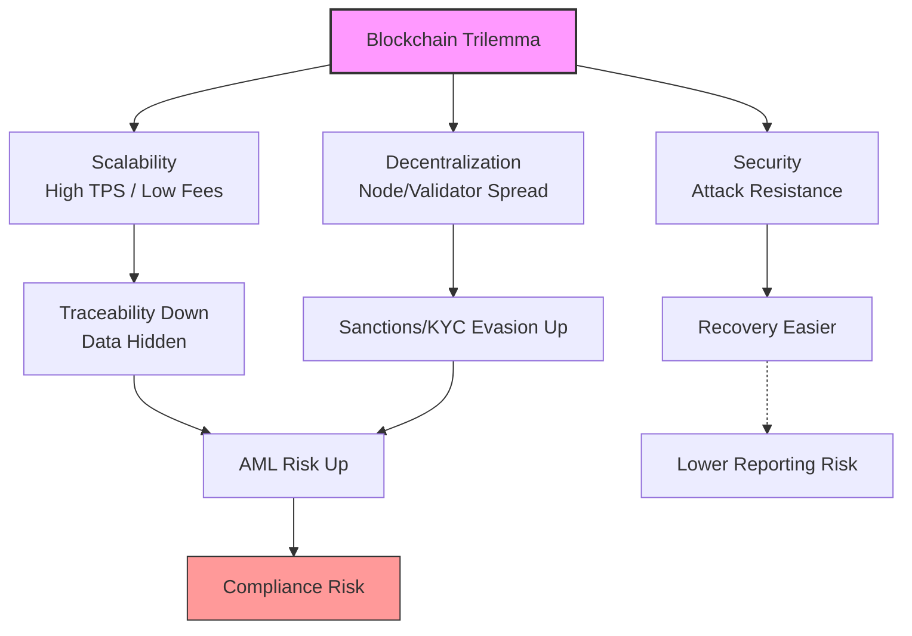

# 01. Blockchain Trilemma: Scalability vs. Compliance Traceability

[](https://github.com/yourusername/crypto-compliance-portfolio)
[](https://github.com/yourusername/crypto-compliance-portfolio)

**Framework Objective**

Show how the classic blockchain trilemma (decentralization,
security, scalability) creates hidden compliance risks for
VASPs and crypto businesses operating under financial
regulators globally, especially in the context of
AML, Travel Rule, and high-risk jurisdiction enforcement.

This is one piece of my crypto compliance portfolio:
deep crypto-native analysis combined with regulatory mapping.

---

## Core Mechanic: The Trilemma as a Zero-Sum Compliance Game

Blockchains must balance three things, but improving one
usually hurts at least one of the others:

**Decentralization** — Many independent nodes/validators
run the network. Hard to censor or shut down, but slower
decisions.

**Security** — Very hard to hack or fake transactions.
Needs strong math and economic penalties, but adds extra
overhead and slowdown.

**Scalability** — Handles thousands of transactions per
second with low fees. Usually bundles a lot of details
(for example in Layer 2 rollups), which makes individual
transactions difficult for compliance.

In compliance language: when a blockchain gets fast and
cheap (scalability), it often hides transaction details.
This makes AML tracing, Travel Rule enforcement, and
sanctions checks much harder.
```python
def trilemma_pressure(protocol_state, regulatory_threshold=10000):
    scalability = protocol_state.tps * protocol_state.batch_efficiency
    if scalability > regulatory_threshold:
        onchain_visibility = max(0, onchain_visibility - protocol_state.compression_factor * 0.3)
        decentralization_stability -= protocol_state.sequencer_centralization_risk
    security = protocol_state.consensus_strength - protocol_state.attack_surface
    compliance_risk = (scalability * (1 - onchain_visibility)) / decentralization_stability
    return compliance_risk  # >1.0 means high regulatory audit concern
```

---

## Compliance Vectors in the Current Regulatory Context

Regulators globally rarely use the word trilemma, but
their enforcement actions are basically punishing the
exact weaknesses that come from these trade-offs.

**Scalability means traceability suffers**

Fast chains and Layer 2s (rollups, sidechains) bundle or
compress many transactions to keep speed high and fees low.
This hides individual sender/receiver details, making it
hard to follow FATF Travel Rule and transaction
monitoring obligations under most AML frameworks.

**High decentralization makes evasion easier**

No central control means it is tough to force KYC
everywhere or block sanctioned wallets. This clashes
directly with enhanced due diligence requirements for
high-risk jurisdictions that most regulators now enforce.

**Security trade-offs create laundering and reporting problems**

Weaker security (concentrated validators, past network
stops, MEV) can allow exploits or reorgs that move dirty
money before anyone notices. This triggers incident
reporting obligations and possible fines for poor
operational resilience under most licensing frameworks.

**Current supervision reality**

Regulators globally now focus on real outcomes: unified
risk pictures (on-chain and off-chain), strong AML
programs, market integrity, and data retention.
Trilemma trade-offs make these harder and more expensive,
especially with upcoming CARF reporting and FATF
evaluation pressure across jurisdictions.

<details>
<summary>Regulatory timeline context</summary>

- FATF updated virtual asset guidance: 2021-2025
- Travel Rule enforcement: active across most major jurisdictions
- Enhanced due diligence for high-risk jurisdictions: active globally
- CARF reporting obligations: 2027 full rollout
- Ongoing enforcement: AML and governance gaps being actioned globally

</details>

---

## Differentiation Edge: Trilemma Compliance Scorecard

This is the scorecard I built to quickly judge chains.
It combines the classic trilemma with real regulatory
priorities like traceability and high-risk jurisdiction
exposure.

```mermaid
graph TD
    A[Blockchain Trilemma] --> B[Scalability<br>High TPS / Low Fees]
    A --> C[Decentralization<br>Node/Validator Spread]
    A --> D[Security<br>Attack Resistance]
    B --> E[Traceability Down<br>Data Hidden]
    C --> F[Sanctions/KYC Evasion Up]
    D --> G[Recovery Easier]
    E --> H[AML Risk Up]
    F --> H
    G -.-> I[Lower Reporting Risk]
    H --> J[Compliance Risk]
    style A fill:#f9f,stroke:#333,stroke-width:2px
    style J fill:#ff9999,stroke:#333
```

**Scoring notes**

Traceability is basically how much transaction detail
you can see on-chain without needing external tools.
Chainalysis or Elliptic support gives a big boost here.

Regulatory Fit is adjusted down if the chain has known
issues with fast illicit flows, validator concentration,
or recent enforcement patterns from financial regulators.

Quick example: if a new L2 doubles TPS but hides 30%
more data, traceability drops sharply and risk jumps.
That is the kind of thing regulators would flag in an audit.

| Protocol | Scalability | Decentralization | Security | Traceability | Regulatory Fit | Overall Balance | Main Risk Flag for VASPs |
|----------|-------------|------------------|----------|--------------|----------------|-----------------|--------------------------|
| Ethereum + L2s (Arbitrum, Optimism, Base) | 8/10 | 7/10 | 9/10 | 7/10 | 8/10 | Balanced | L2 data compression needs external AML tools |
| Solana | 9/10 | 5/10 | 7/10 | 6/10 | 6/10 | Speed-first | Very fast, easy to miss suspicious flows |
| zkSync Era / Polygon zkEVM | 8/10 | 6/10 | 8/10 | 8/10 | 8.5/10 | Privacy + scale | ZK allows selective reveal, good for regulators |
| BNB Chain | 7/10 | 4/10 | 7/10 | 9/10 | 7/10 | Centralized | Easy audits but decentralization concerns |

---

## Practical Value for Crypto Compliance Roles

This scorecard is not just theory. It is a practical tool
for any VASP or crypto business to make smarter decisions
quickly:

Evaluate new chains or L2s before integrating them for
custody, trading, or transfers.

Spot AML blind spots early, for example why Solana's
speed might create monitoring gaps under transaction
monitoring rules.

Prepare stronger responses for regulatory supervision,
incident reporting, or licensing applications.

---

## References and Technical Summary

I put this scorecard together after spending a few months
reading regulatory documentation and chain analytics.
It is my way of connecting the dots, not from any
one article.

**Data Sources and Methodology**

Scalability: Effective TPS and fee data from Solana Beach
and Dune Analytics dashboards (Solana peak ~65k TPS in
bursts, Ethereum L2s aggregated ~100k+ TPS via rollups).
Adjusted for real-world sustained performance, not just
theoretical claims.

Decentralization: Nakamoto coefficient and validator/node
Gini from Lido reports, EigenLayer data, and Solana
validator stats (Solana's Nakamoto coeff ~19-25, medium
centralization risk).

Security: Historical exploit/outage data from Rekt.news,
DefiLlama hacks list, and Chainalysis 2025 Crypto Crime
Report. Economic security via staked value and slashing
mechanisms (Ethereum PoS ~$100B+ staked, high security).

Traceability: On-chain visibility estimates from
Chainalysis Reactor and Elliptic tooling reports.
Calldata compression impact from EIP-4844 analyses.
ZK-rollups score higher due to potential for selective
disclosure (zk-SNARK/STARK proofs).

Regulatory Fit: Weighted average with heavy emphasis
on traceability and decentralization/sanctions exposure,
based on FATF Recommendation 16 (Travel Rule), FATF
virtual asset guidance (2021-2025), and upcoming CARF
reporting obligations (2027 full rollout).

**Why this matters technically for compliance**

The trilemma is not just academic. It directly affects
AML/CFT program effectiveness.

High scalability via data compression (Optimistic/ZK
rollups) reduces on-chain calldata, lowers signal-to-noise
ratio for clustering heuristics and address linking, and
increases false negatives in transaction monitoring.

Validator concentration (Solana or BNB) raises
single-point-of-failure risk for sanctions screening
and could trigger governance flags under operational
resilience rules in most licensing frameworks.

ZK tech enables prove-knowledge-without-revealing patterns,
a potential bridge between privacy and compliance. For
example, prove non-sanctioned status via zero-knowledge
proofs without exposing the full transaction graph.

Scores are directional estimates. In practice I would
integrate live feeds (Chainalysis API, Dune queries)
and update quarterly based on new regulatory circulars
or protocol upgrades.

**Sources summary:**

- FATF Guidance for Virtual Assets (updated 2021-2025)
- Chainalysis 2025 Crypto Crime Report
- L2Beat.com and DefiLlama
- Dune Analytics queries and Messari protocol reports

---

Open to feedback, questions, or forks. If you work in
crypto compliance, happy to chat about how this applies
in practice.
